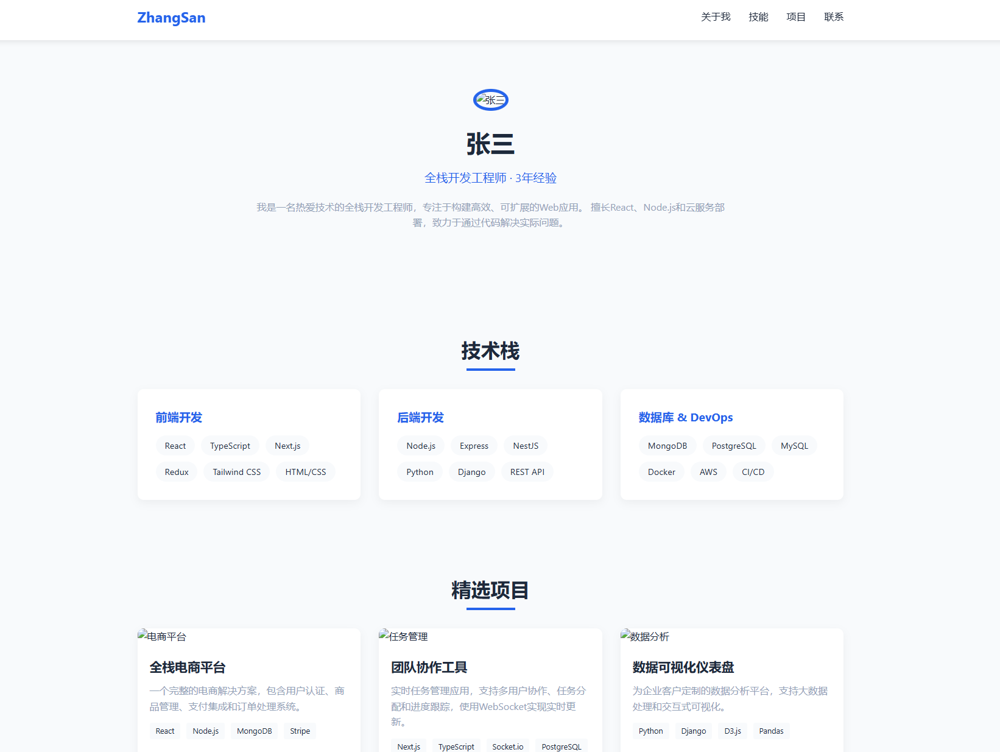

# 项目名称

- 本地预览：http://127.0.0.1:5500/sample-01/index.html
- github-pages 预览地址：
- 预览效果：



- 生成 AI 工具：[deepseek](https://chat.deepseek.com/) / gpt4-o1
- AI 提示词

```text
 

提示词：

```
提示词：

以下是对您前几次提出的问题和要求的总结提示词，经过润色整理，便于后续使用：

---

**提示词总结：**

请帮我设计一个高级前端开发工程师的个人作品展示网页，要求如下：

1. 页面整体风格简洁现代，结构清晰，配色专业，支持黑白（暗）主题切换功能。
2. 顶部导航包含网站标题、锚点导航菜单和“预览简历”按钮（新页面打开，支持PDF下载），导航部分不展示头像。
3. 个人头像仅在“关于我”板块展示，头像清晰且有边框突出。
4. “关于我”部分需体现6年高级前端开发工程师的专业水平，语言精炼且突出技术深度、架构设计、性能优化及团队协作能力。
5. 技术栈以小卡片墙形式展示，每个卡片包含对应技术的官方或社区图标，卡片风格统一美观，带悬浮效果。
6. 工作经历使用时间线形式展示，包含工作时间、公司名称、职位，职位随时间递进；工作内容需详细且围绕项目特点展开，突出高级开发或高潜力开发者的职责和成就。
7. 项目经历板块保持丰富，项目内容包括技术栈、关键难点、解决方案及效果，排版美观，卡片设计带图片。
8. 新增个人项目板块，列出多个个人项目，简要介绍项目名称、技术栈及亮点。
9. 联系方式部分包含邮箱、电话和GitHub链接，配合图标，居中排列，易于访问。
10. 页面整体响应式，适配不同屏幕尺寸，交互流畅，视觉舒适。


请使用 html, css, js, tailwindcss 技术栈进行开发，输出一个 html 文件。

```