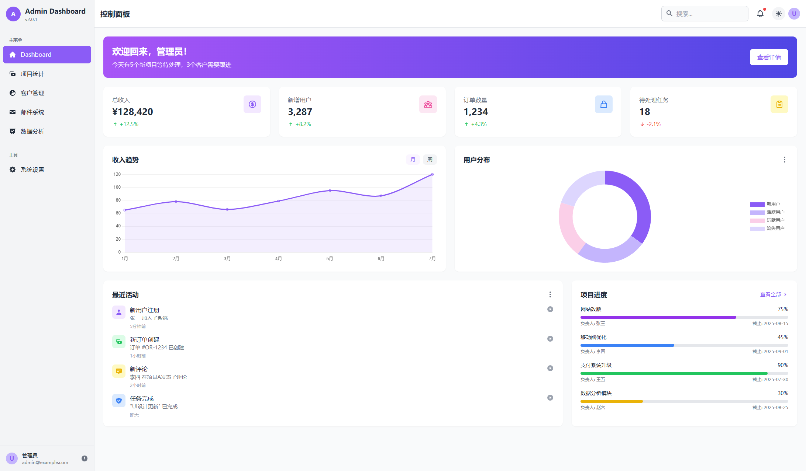

# 项目名称



- github-pages 预览地址：https://jsmond2016.github.io/ai-html-tailwindcss-samples/sample-08/
- 本地预览：http://127.0.0.1:5500/sample-08/index.html

- 生成 AI 工具：腾讯元宝-deepseek
- AI 提示词: 先找到目标网页，截图，给豆包，让它分析图片的设计风格，生成 AI 提示词；

```text
请帮我生成一个 admin 网页首页，技术栈实现使用 html, css, tailwindcss, jquery，输出为 html 格式；以下是设计风格要求：

色彩运用：以柔和且富有科技感的紫色为主色调，搭配白色、浅粉色、淡紫色等清新辅助色，营造出时尚、专业且不失活力的视觉氛围，同时提供浅色（Dashboard Light）和深色（Dashboard Dark）两种主题模式，满足不同使用场景和用户视觉偏好。


布局设计：采用典型的后台管理系统布局，左侧为侧边导航栏，清晰罗列各类功能模块（如 Dashboard、Projects、Contacts 等 ），便于快速定位；中间及右侧为主要内容展示区，信息分区明确，通过卡片式设计规整呈现项目统计、客户数据、邮件分类等内容，视觉层次清晰，信息获取高效。
元素样式：图标简洁直观，契合功能表意；按钮造型简约，圆角设计增加柔和感；数据可视化部分（如柱状图、饼图等 ）色彩搭配协调，既突出数据差异，又与整体风格统一，助力用户快速理解数据含义 。
响应式适配：适配多种设备（如桌面端、笔记本、平板、手机 ），不同设备下布局自动调整优化，保证在各类终端都有良好视觉呈现和操作体验，实现跨设备的一致性与易用性。


交互风格描述

导航交互：左侧侧边导航栏，鼠标悬停或点击时，菜单项有清晰的视觉反馈（如颜色变化、展开子菜单动画 ），支持多级菜单展开与收起，方便用户快速访问不同功能模块，且在移动端可通过简洁的交互方式（如侧滑、点击展开 ）适配操作。

数据操作交互：对于数据展示卡片（如项目统计、客户信息卡片 ），点击卡片或卡片内特定区域（如操作按钮 ），可触发弹窗、跳转新页面等交互，用于查看详情、编辑数据、执行任务（如 “Try free Now” 按钮引导试用操作 ）；数据可视化图表具备基础交互，如鼠标悬停显示数据详情，助力用户深度挖掘数据价值。

主题切换交互：提供浅色和深色主题切换功能，切换操作便捷（一般在页面显眼位置或设置菜单 ），切换过程有
平滑过渡动画，让视觉体验更流畅，满足用户在不同光线环境（白天 / 夜晚 ）或个人视觉喜好下的使用需求 。

全局交互细节：搜索框、通知提醒等全局功能，交互简洁高效，搜索输入实时反馈、通知图标点击展开列表等，整体交互逻辑符合用户对后台管理系统的操作习惯，注重操作流畅性与便捷性，降低用户学习成本 。

```